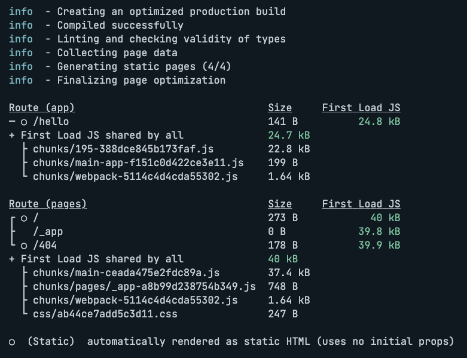
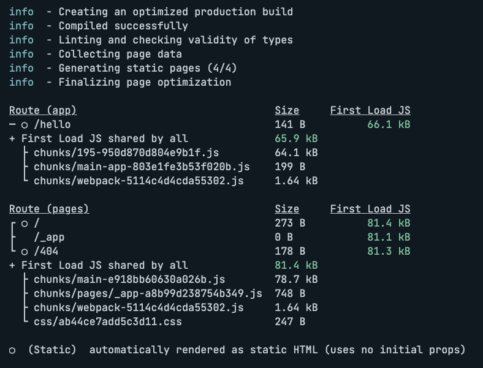

# Use Preact in Next.js 13

## Introduction

Next.js uses React by default. In this blogpost, I want to replace React with Preact and compare the build differences.

Preact is a JavaScript library, considered the lightweight 3kb alternative of React with the same modern API and ECMA Script support. Preact has the fastest Virtual DOM compared to other JavaScript frameworks. It is small in size. Tiny! It is designed to work in a browser with DOM, which justifies why it is so tiny.

## Why Replace React

There are a few reasons why you would do this and there are some other posts that explain it very well.

The key distinction is that Preact lacks several of the experimental features included in React, like Suspense and Concurrent Mode. You have a strong argument for replacing React with Preact if you don't use any of these of the more sophisticated features of React.

I'll summarize some of the reasons you should replace React with Preact.

1. Preact provides the thinnest possible Virtual DOM abstraction on top of the DOM.
2. Preact has a small size!
3. Preact is fast, and not just because of its size.
4. Preact is highly compatible with React API and supports the same ECMA Script
5. Preact has a package named preact/compat to let developers use React libraries with Preact.

> Learn more about the differences of Preact from React [here](https://preactjs.com/guide/v8/differences-to-react/)

## Get Started

Let's start by creating a new Next.js app.

```sh
npx create-next-app next-with-preact --use-pnpm
```

Next, we need to install Preact in app.

```sh
pnpm install preact
```

## Setup `app` Directory in Next.js 13

Next.js 13 introduces layouts with the `app` directory. To use the `app` directory, add the following to your `next.config.js` file.

```js
module.exports = {
  reactStrictMode: true,
  swcMinify: true,
  experimental: {
    appDir: true,
  },
};
```

In the main directory, create an `app` directory and a `hello` directory in the `app` directory. Add a `page.tsx` in the `hello` directory.

The `app` directory should look like this

```
app/
├── hello
│   └── page.tsx
├── head.tsx
└── layout.tsx
```

> The `head.tsx` and `layout.tsx` will be generated when you start your server in dev environment.

Add the following to your `app/hello/page.tsx`

```tsx
export default function HelloPage(): JSX.Element {
  return <div>Hello from app directory</div>;
}
```

Replace the contents of `pages/index.tsx` with a simple page component.

```tsx
export default function Home() {
  return <div>Index Page from pages directory</div>;
}
```

Run your app with `pnpm dev` and inspect http://localhost:3000/ and http://localhost:3000/hello to confirm everything is working.

## The Swap

Once everything is working, we need to swap React with Preact in our Next.js app.

We need to tell Next.js that we'd like to swap out React for Preact by using Webpack's [aliasing](https://webpack.js.org/configuration/resolve/#resolvealias) feature only in client production build. The `dev` server will run with React.

Let's update our `next.config.js` with the following

```js
module.exports = {
  reactStrictMode: true,
  swcMinify: true,
  experimental: {
    appDir: true,
  },

  webpack: (config, { dev, isServer }) => {
    if (!dev && !isServer) {
      Object.assign(config.resolve.alias, {
        "react/jsx-runtime.js": "preact/compat/jsx-runtime",
        react: "preact/compat",
        "react-dom/test-utils": "preact/test-utils",
        "react-dom": "preact/compat",
      });
    }
    return config;
  },
};
```

That's it!

Once you build your Next.js application with `next build`, you should see a decrease in bundle size. Compare the build results for our demo application.

With Preact


With React


## `next-plugin-preact`

The Preact Team provides a plugin for use with Next.js. It works in both `dev` and `production` environments.

### Install the plugin

```sh
pnpm install next-plugin-preact preact react@npm:@preact/compat react-dom@npm:@preact/compat react-ssr-prepass@npm:preact-ssr-prepass preact-render-to-string
```

### Usage

Use the plugin your `next.config.js` like this

```js
// next.config.js
const withPreact = require("next-plugin-preact");

module.exports = withPreact({
  /* regular next.js config options here */
});
```

If you are not using any experimental React features in your Next.js app, I would recommend replacing React with Preact to reduce your bundle size by a considerable chunk.
